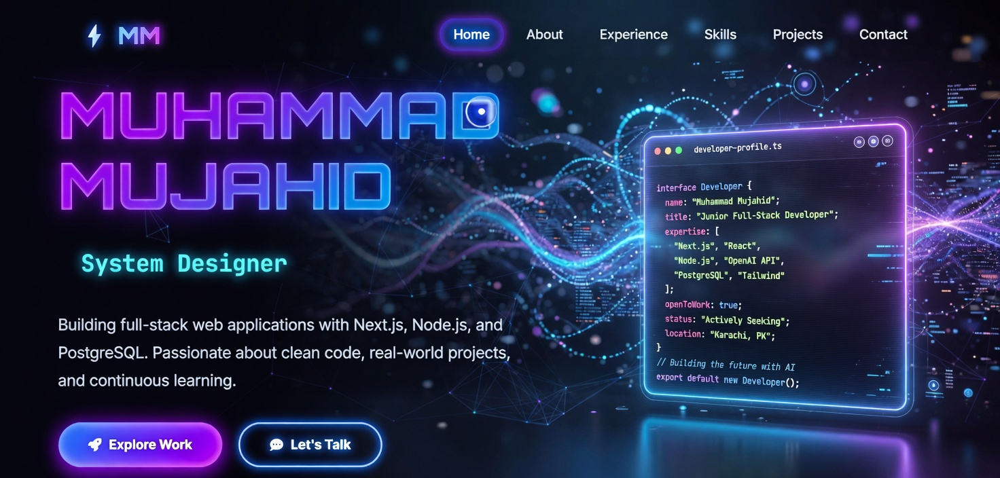
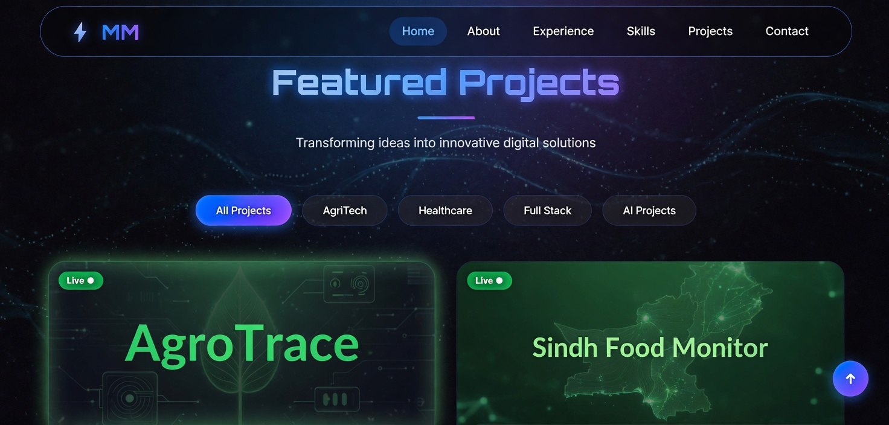

<div align="center">



<br><br>

# Muhammad Mujahid — Developer Portfolio
### Full Stack Developer · System Designer · Karachi, Pakistan

**Building full-stack web applications with Next.js, Node.js, and PostgreSQL**

[](https://my-portfolio-swart-nu-73.vercel.app)
[](https://linkedin.com/in/muhammad-mujahid-dev)
[](mailto:muhammad.mujahid.dev@gmail.com)


</div>

---

## 🖼️ Screenshots

<div align="center">

**Hero Section**


**Featured Projects**


**Technical Skills**


</div>

---

## ✨ Sections

- **Hero** — Animated intro with live developer profile card
- **About** — Background, education, and downloadable CV
- **Experience** — Freelance and professional history
- **Skills** — Categorized tech stack with proficiency bars
- **Projects** — 6 projects with live demos, GitHub links, and filter by category
- **Contact** — Direct email, WhatsApp, LinkedIn, and GitHub

---

## 🛠️ Built With

| Layer | Technology |
|---|---|
| **Structure** | HTML5, Semantic markup |
| **Styling** | CSS3, Bootstrap 5, custom animations |
| **Interactivity** | Vanilla JavaScript, AOS scroll animations |
| **Icons** | Font Awesome 6 |
| **Fonts** | Google Fonts |
| **Deployment** | Vercel |

---

## 🚀 Featured Projects

| Project | Stack | Status |
|---|---|---|
| [AgroTrace](https://agrotrace-n65b.vercel.app) | Next.js · PostgreSQL · TypeScript | 🟢 Live |
| [Sindh Food Monitor](https://sindh-food-supply-tracking-dashboar.vercel.app) | Next.js · TypeScript · Recharts | 🟢 Live |
| [MediVerse ClinicOnline](https://mediverse-eta.vercel.app) | Next.js · NextAuth · TypeScript | 🟢 Live |
| Smart Task Manager | Next.js · FastAPI · OpenAI · PostgreSQL | 🟣 In Progress |
| AI Task Manager | Next.js · FastAPI · OpenAI · JWT | 🟣 In Progress |
| Matrix LMS | Next.js · Node.js · Prisma · PostgreSQL | 🟣 In Progress |

---

## 🚀 Quick Start

```bash
# Clone
git clone https://github.com/Mujahidaryan/My-Portfolio.git
cd My-Portfolio

# Open directly in browser — no build step needed
open index.html
```

Or deploy instantly on Vercel:
1. Import repo at [vercel.com/new](https://vercel.com/new)
2. Framework: **Other**
3. Click **Deploy** — live in 30 seconds

---

## 👤 Author

**Muhammad Mujahid** — Full Stack Developer, Karachi, Pakistan

[](https://linkedin.com/in/muhammad-mujahid-dev)
[](https://github.com/Mujahidaryan)
[](https://my-portfolio-swart-nu-73.vercel.app)
[](mailto:muhammad.mujahid.dev@gmail.com)

---

## 📄 License

MIT © 2026 Muhammad Mujahid
